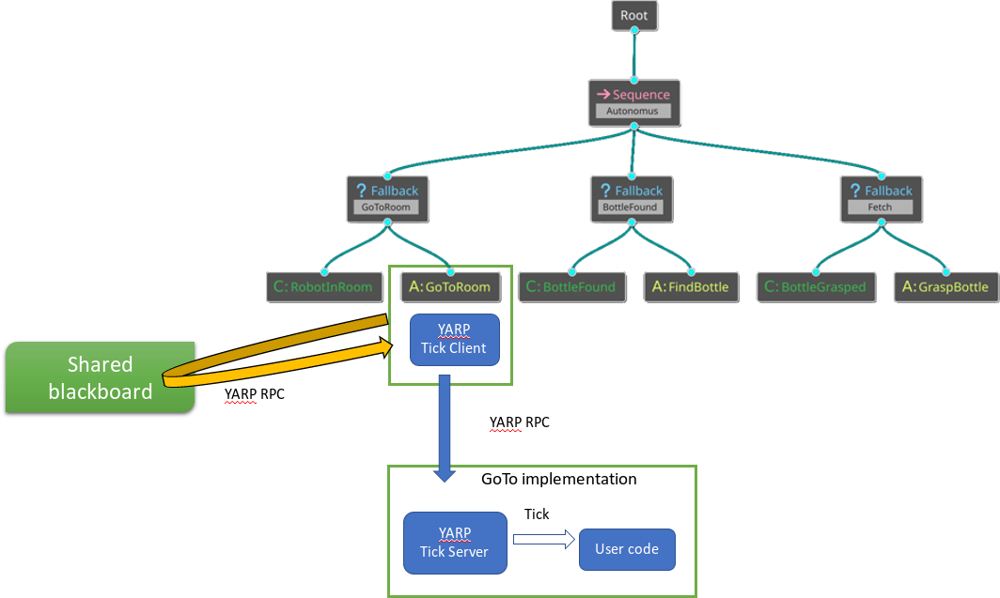
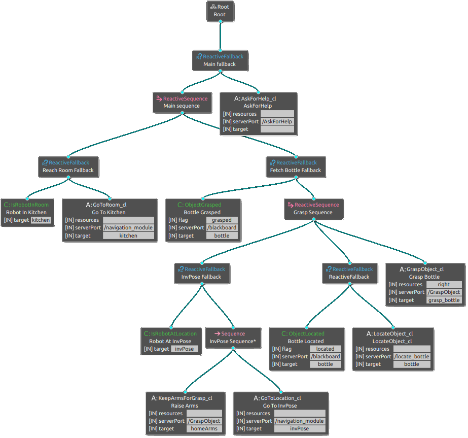
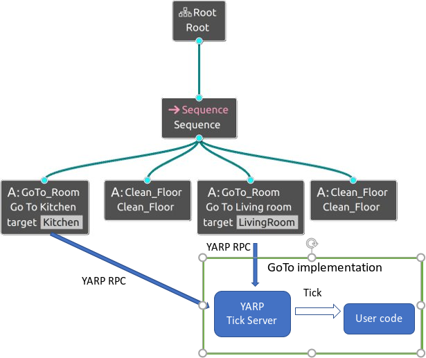

# Behavior Trees in YARP #

### Table of Contents

  * [What is this repository for?](#what-is-this-repository-for)
  * [Repository Structure](#repository-structure)
  * [Installation](#installation)
  * [Quick glance at Behavior Trees in YARP](#quick-glance-at-behavior-trees-in-yarp)
  * [Targets](#targets)
  
  
### What is this repository for?
This repository contains the libraries to create Behavior Tree nodes and the engine required to run a full BT.
The nodes can be created as pure YARP code or integrated with [BehaviorTree.CPP](https://github.com/BehaviorTree/BehaviorTree.CPP) library.


### Repository Structure ###
This package contains:

Libraries:
- [YARP BT wrapper lib](libs/BT_wrappers): Client/Server YARP wrapper to handle the network communication and propagate the `tick` from the engine to the leaf node implementing the functionality. Thrift powered.
- [BT_CPP_leaves](libs/BT_CPP_leaves): a basic and flexible set of predefined BT leaf nodes compatible with [BehaviorTree.CPP](https://github.com/BehaviorTree/BehaviorTree.CPP) library.

Executables:
- Behavior Tree engine using [BehaviorTree.CPP](https://github.com/BehaviorTree/BehaviorTree.CPP) library and compatible with [Groot](https://github.com/BehaviorTree/Groot) GUI.
- Set of executable nodes handling common funtionalities of the robot, like navigation.
- Blackboard for sharing data between nodes and other parameters.

### Installation ###

Dependencies:

In order to implement new nodes, the only dependency required is [YARP](https://github.com/robotology/YARP).
If you wish to run the engine or create new a leaf node, then [BehaviorTree.CPP](https://github.com/BehaviorTree/BehaviorTree.CPP) library is required.

Download and build the repository 

```console
$ git clone https://github.com/CARVE-ROBMOSYS/YARP-BT-modules
$ cd YARP-BT-modules
$ mkdir build
$ cd build
$ cmake ..
$ make -j
```

If BehaviorTree.CPP library is found, corresponding nodes and the engine will automatically be compiled.
It is then required to add the `BT_CPP_PLUGIN_DIRS` environment variable pointing to the `lib` folder in the build or install path, in order to load the node plugins at runtime.


### Quick glance at Behavior Trees in YARP

The general idea is shown in the picture:



The engine will send `tick` request to the nodes, either actions or conditions. The node will fetch required parameters from the BlackBoard (a YARP executable) and then propagate the `tick` to the server implementing the action, via YARP message. The return value is an enum value defining the state of the node; after the engine receives the return value it'll continue the execution accordingly. Requests and return values are defined in the [thrift file](libs/BT_wrappers/thrift/BT_wrappers.thrift).

The Behavior Tree engine has two parameters:

- bt_description [**required**]: this is the name of the xml file containing the behavior tree description. It will be searched and loaded with the YARP resource finder, so the `--context` option can be used to better specify where to look for and the `--verbose` option will print all the paths the ResourceFinder is searching into.
- libraries [**required for external plugins**]: this is the name of the plugin library the nodes have to be loaded from.
For example this repository creates a library called `libBT_CPP_leaves.so` containing all the basic nodes. For more information they are described [here](https://github.com/barbalberto/YARP-BT-modules/tree/refactorPostCarve/libs/BT_CPP_leaves). This library is automatically added as a source of plugins, so there is no need to specify it, but 
if you need to load plugins created by a different repository, the name of that library is then required. The library 
will be searched in the paths contained in the `BT_CPP_PLUGIN_DIRS` environment variable. Note: the env var shall always point at least to the folder containing `libBT_CPP_leaves.so` since this library is always required.

`BT_engine_cpp --bt_description my_BT.xml --context my_working_context --libraries my_lib.so`

The Groot GUI will show the graphical representation of the BT like in the following picture.




To understand how BT nodes communicate in YARP, see [YARP BT wrapper lib](libs/BT_wrappers) <br>
Then to better understand the integration with BehaiorTree_CPP library and the engine, see [BT_CPP_leaves](libs/BT_CPP_leaves)

### Targets

Target is an important concept that helps bridging the gap from a conceptual behavior tree and its node implementation.
In a pure BT each node is a standalone instance of a class, therefore using the same node twice generates two separated instances that can work together, also in parallel. For complex task, like for example the navigation task, it is common to have a single component carring out the task (or a stack of components working together) and a single point of access where requests are sent along with the required parameters. This architecture does not fit well in a behavior tree approach, because it is not efficient to instantiate all the navigation stack every time a move action is required and the tick function does not allows parameters.

An example is shown in the picture.



The `target` is the approach used to overcome these limitations: each node in the BT has a target (optional) which has a threefold usage:
  - Allows transparent node re-use as expected from a behavior tree
  - It is the node *principal parameter*, used as a *key* to retrieve addictional parameters from the shared BlackBoard. For more information about the BlackBoard see [here](libs/BT_wrappers/BlackBoard)
  - Allows node implementation (es: navigation stack) to distinguish between different requests. This means that 
  a `halt` request to node GoTo_LivingRoom will not stop the GoTo_Kitchen action from running, even though the server executable receiving both requests is the same one.

### Responsible ###

Michele Colledanchise michele.colledanchise@iit.it
